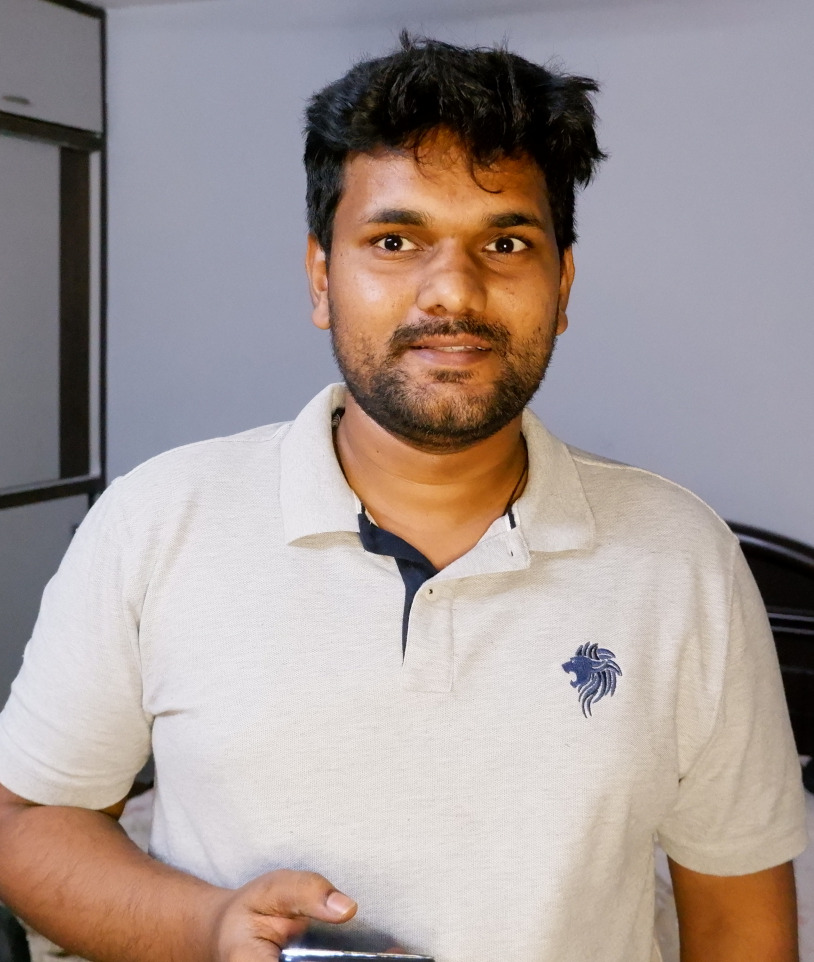

Hi there 👋 know more about me

<h2 align=center>Raajashekher</h2>												

|                                                              |                                                              |
| :----------------------------------------------------------: | :----------------------------------------------------------: |
|         #  Linux changed the way I look at computers         |  |
|                     # Crawling in Python                     |  |
|  |  |
|       # Trying to adapt to be with Rust yet efficient        |  |
|                        # Building Go                         |  |

I am a technology enthusiast completed my graduation and started building Embedded systems for quite some time, interested in  HPC, Artificial Intelligence, Robotics so pursued Data Science Postgraduate Diploma from Imarticus Learning and got a job offer as AI developer at Cognitive innovations at Vizag(City of destiny) . Working as Systems engineer in the field of computer vision  now.

 
